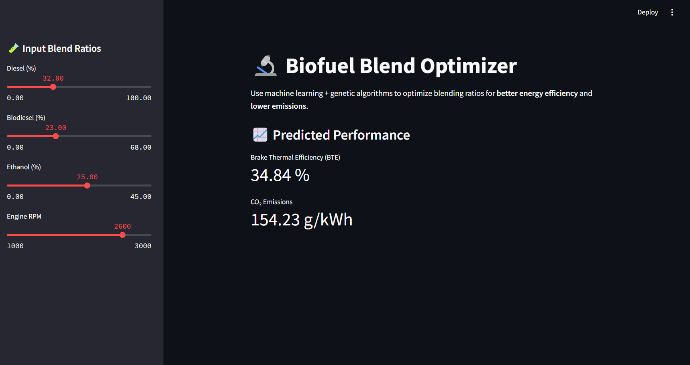

# 🚀 AI-Driven Optimization of Biofuel-Petroleum Blending Ratios for Sustainable Energy

This project applies machine learning models and multi-objective genetic algorithms to optimize biofuel blends, aiming to **maximize Brake Thermal Efficiency (BTE)** and **minimize CO₂ emissions**. It includes:

- A Python script for model training and optimization
- An interactive dashboard for real-time predictions

---

## 📁 Files

- `biofuel_optimization.py`: Trains ML models, performs optimization using NSGA-II, and identifies Pareto-optimal blend combinations.
- `dashboard.py`: Streamlit-based dashboard to interactively predict BTE and CO₂ emissions from user-inputted blend ratios and engine RPM.

---

## 📊 Dashboard Preview

The Streamlit app allows users to:
- Select proportions of Diesel, Biodiesel, and Ethanol
- Adjust engine RPM
- Get real-time predictions for BTE and CO₂ emissions

### Sample Screenshot
 

---

## 🛠️ Technologies Used

- Python, Pandas, NumPy
- Scikit-learn (for Random Forest Regressors)
- DEAP (for NSGA-II optimization)
- Streamlit and Plotly (for the dashboard)
- Pickle (for model persistence)

---

## ⚙️ How to Run

### 1. Clone the Repository

```bash
git clone https://github.com/Atul-04/Course_project.git
cd Course_project
```

### 2. Install Requirements

```bash
pip install -r requirements.txt
```

Contents of `requirements.txt`:
```
pandas
numpy
scikit-learn
deap
streamlit
plotly
```

### 3. Run Optimization Script (Optional)

```bash
python biofuel_optimization.py
```

This will train the models and save:
- `bte_model.pkl`
- `co2_model.pkl`
- `scaler.pkl`

### 4. Launch the Dashboard

```bash
streamlit run dashboard.py
```

---

## 📁 Dataset

The dataset `biofuel_engine_dataset.csv` contains experimental results for different blend ratios and RPMs. It is required for initial model training.

---

## 📌 Project Structure

```
biofuel-optimizer/
├── biofuel_optimization.py
├── dashboard.py
├── scaler.pkl
├── bte_model.pkl
├── co2_model.pkl
├── biofuel_engine_dataset.csv
├── requirements.txt
└── README.md
```

---

## 📘 License

This project is for academic use under the course **CL653 - Applications of AI and ML for Chemical Engineering**.

---

## 🙌 Acknowledgements

- [Scikit-learn](https://scikit-learn.org)
- [DEAP - Evolutionary Algorithms in Python](https://deap.readthedocs.io)
- [Streamlit](https://streamlit.io)
